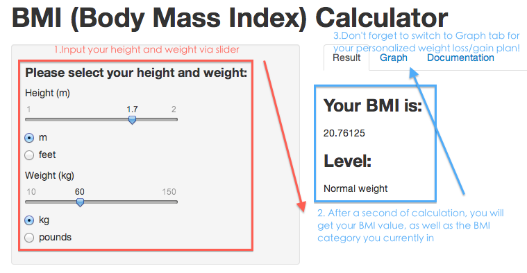

## Getting Started

<div>

</div>
It helps you:
* Find out your current BMI status (in 'Result' tab)
* Make weight loss/gain plan to achieve expected BMI category (in 'Graph' tab)

---

## BMI calculation sample code and formula

```{r}
w <- 60   # when user enter 60 kg as weight
h <- 1.7  # when user enter 1.7 m as height
w/h^2     # calculate BMI
```
$$BMI=\frac{Weight (kg)}{Height^2 (m)}$$
UI sample code:  apply conditionPanel to allow user switch weight/height unit system
```{r, eval=FALSE}
    conditionalPanel(condition="input.weight_unit=='kg'",
      sliderInput('weight', 'Weight (kg)',value=60,min=10,max=150,step=1)),  
    conditionalPanel(condition="input.weight_unit=='pounds'",
      sliderInput('weight2','Weight (pounds)',value=130,min=22,max=330,step=2)),
    radioButtons("weight_unit","",c("kg"="kg","pounds"="pounds"))
```

---

## Weight Loss/Gain Calculator

#### Provide graphical tips for users to learn which BMI category they would achieve after lose or gain some weight  (at 'Graph' tab)
```{r, echo=FALSE}
h <-1.7 # m
w <- 60 # kg
calculator <- function(w) w/h^2
bmi = calculator(w)
plot (calculator, 0, 100, n=10, xlab="Weight (kg)", ylab="BMI")
points(w,bmi, bg='blue', pch=21, cex=3, lwd=3)
lower_bound = -10
upper_bound = 100
right_bound = w*3
left_bound = -10

ob = 30*h^2 # line for obesity/overweight
ov = 25*h^2 # line for overweight/normal weight
no = 18.5*h^2 # line for normal weight/underweight

rect(left_bound, lower_bound, no, upper_bound, col= '#F7FA0022', border = "transparent")
rect(no, lower_bound, ov, upper_bound, col= '#00F7FA22', border = "transparent")
rect(ov, lower_bound, ob, upper_bound, col= '#EFA2A122', border = "transparent")
rect(ob, lower_bound, right_bound, upper_bound, col= '#BD211F22', border = "transparent")        
text(no/2,10,'Underweight') # different y value is for avoiding label overlap
text(no+(ov-no)/2,15,'Normal weight')
text(ov+(ob-ov)/2,10,'Overweight')
text(ob+10,20,'Obesity')
text(w,bmi+3,'Your position') # -5 to avoid overlap
```

---

## Weight Loss/Gain Calculator
Partial Sample Code to draw the graph (please refer to my github for complete code)
```{r, echo=TRUE, eval=FALSE}
# BMI calculation fomula
calculator <- function(w) w/h^2 
# draw the graph showing corresponding changes on BMI when weight increase/decrease
plot (calculator, 0, 100, n=10, xlab="Weight (kg)", ylab="BMI") 
# user's current position
points(w,calculator(w), bg='blue', pch=21, cex=3, lwd=3) 
# use rect() to draw four area indicating different categories
rect(left_bound, lower_bound, normal_weight, upper_bound, col= 'yellow') 
rect(normal_weight, lower_bound, overweight, upper_bound, col= 'blue') 
rect(overweight, lower_bound, obesity, upper_bound, col= 'orange') 
rect(obesity, lower_bound, right_bound, upper_bound, col= 'red')
```
### Enjoy !  (https://paullo.shinyapps.io/develope_data_product/)


